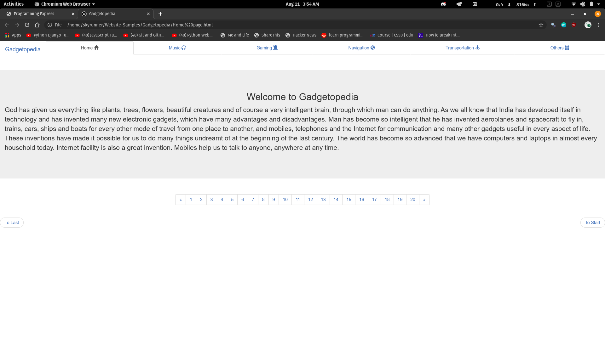
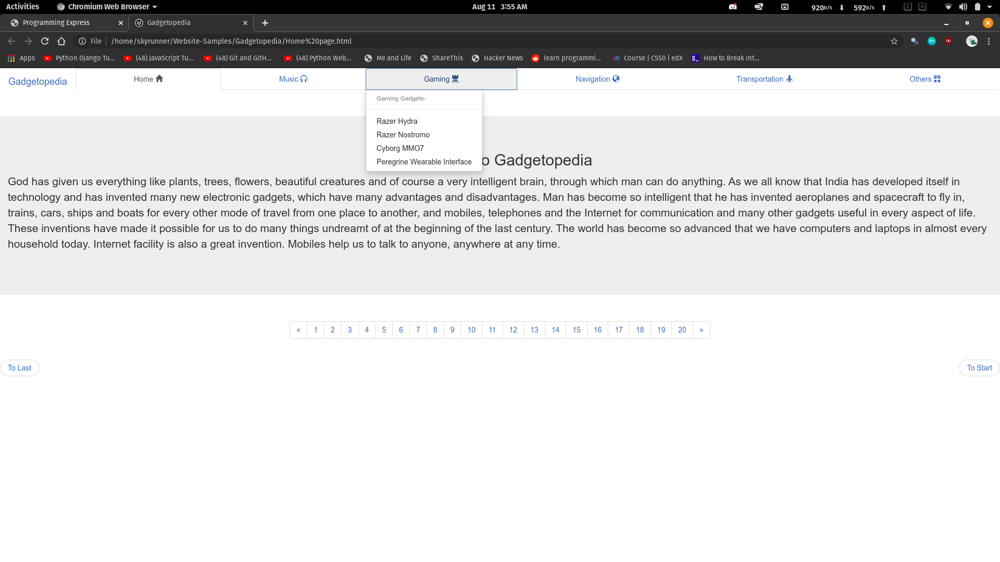
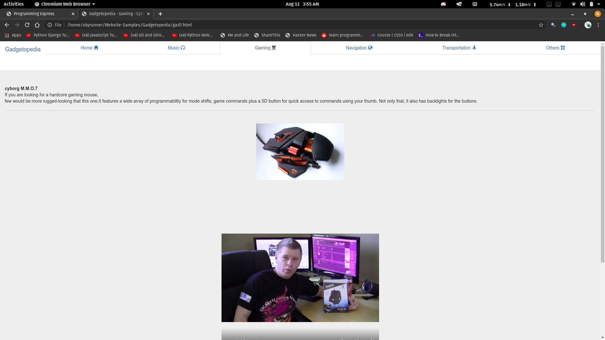
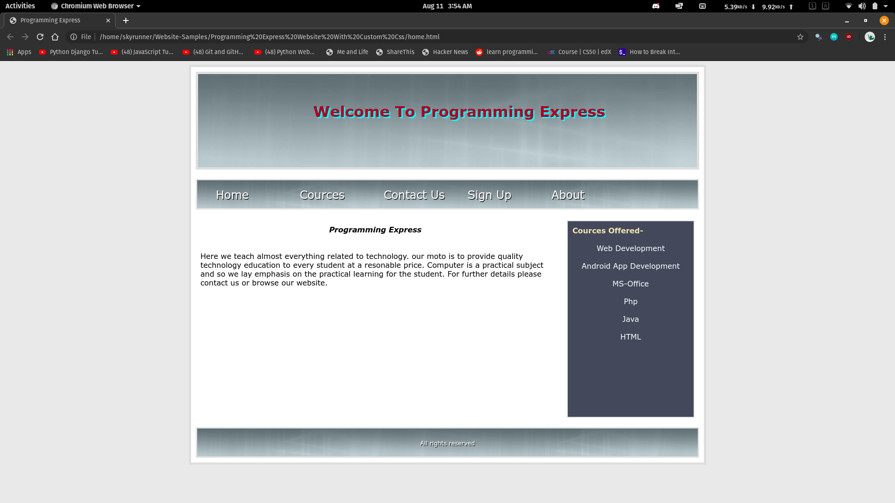

# Website-Samples By Rishi Mathur

These are some websites that I made while learning HTML and CSS. 
`They are not deployable, They are only meant to be used as samples.`
- __The Gadgetopedia Website is developed using BootStrap and HTML__

  

---
- __Programming Express website was entirely made from scratch using Custom CSS__

